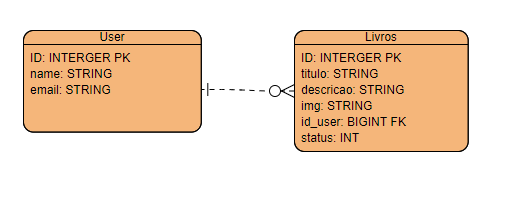

# Sistema Estante de Livros

### Autor

 - Desenvolvedor: Alexandre Silva
 - Email: alexandrebmx5@gmail.com

#### Frameworks

 - [Dart 2.13.0](https://dart.dev/)
 - [Flutter 2.2.0](https://flutter.dev/)
 - [Guia de estilo código em flutter](https://github.com/flutter/flutter/wiki/Style-guide-for-Flutter-repo)

#### Diagrama de Entidade-Relacionamento


#### Nota

Sendo o banco de dados utilizado Firebase, o sistema está alocado em nuvem no Firebase-Hosting

Para a analise do banco de dados, pode enviar um Email solicitando o acesso ao firebase.

## Requisitos para executar a aplicação
 1. [Flutter](https://flutter.dev/docs/get-started/install)
 1. [Docker](https://www.docker.com/products/docker-desktop)

 *O executavel para windows já contem as duas dependências*.

Certifique-se de instalar a atualização do kernel do Linux para Windows.

faça o build do projeto, na pasta raiz do projeto execute o comando:
```
flutter build web --web-renderer html --release
```

com o docker instalado, execute o comando:
```
docker build . -t estante_livros
```

em seguida execute:
```
docker run -i -p 8080:4040 -td estante_livros
```

pronto!

O aplicativo agora está sendo executado em localhost: 8080. Navegue até lá em um navegador para ver o aplicativo!

### Acesso online Firebase Hosting

[Link](https://estante-de-livros.web.app/)

